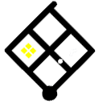

# fabric-witness

## What is it?

The fabric mod that adds puzzle frames from The Witness to Minecraft

This is also a companion mod for The Witness Minecraft [youtube](https://www.youtube.com/channel/UCrLikF1yl6dqz0N9OaJlAcA) series - and adds a variety of decoration blocks to the game to recreate the island

## How do I get it?

- Head over to [releases](https://github.com/xxfast/fabric-witness/releases) and download the jar in the assets
- Load it up with [fabric mod loader](https://fabricmc.net/)

Make sure to also load in these dependencies

1. [fabric-api](https://www.curseforge.com/minecraft/mc-mods/fabric-api)
2. [fabric-language-kotlin](https://www.curseforge.com/minecraft/mc-mods/fabric-language-kotlin)
3. [lib-gui](https://github.com/CottonMC/LibGui)
4. [nbt-crafting](https://www.curseforge.com/minecraft/mc-mods/nbt-crafting)

## Releasing

1. Update the mod version in `gradle.properties`
2. Add a changelog entry in `CHANGELOG.md`
3. Commit with a message like `Prepare for relase vX.Y.Z`
4. Tag with `vX.Y.Z`
5. Push branch, and the tags

## License

CC0 1.0 Universal © Isuru Rajapakse
