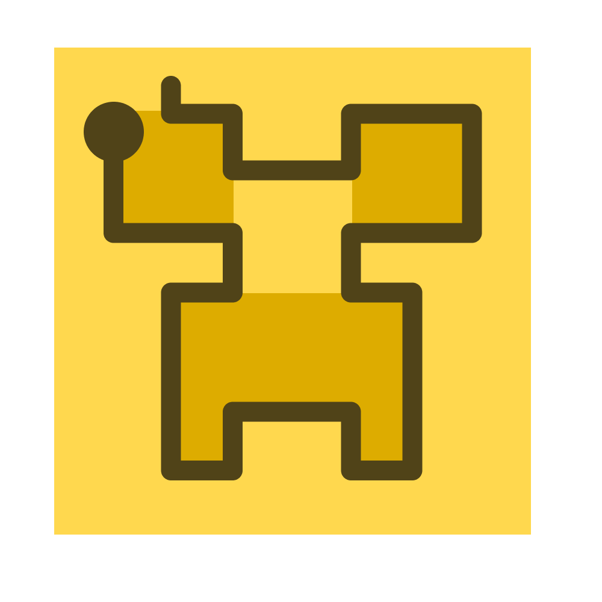

# fabric-witness

## What is it?

A helper mod for The Witness Minecraft [youtube](https://www.youtube.com/watch?v=NtJE8jozI7U&list=PLgH8mtb5RMVNGH4sPxEjHp7FCWXt_txtF) series that adds a variety of blocks to the game to recreate the island from the game The Witness 

## License

Copyright 2020 © Isuru Rajapakse

Licensed under the Apache License, Version 2.0 (the "License");
you may not use this file except in compliance with the License.
You may obtain a copy of the License at

    http://www.apache.org/licenses/LICENSE-2.0

Unless required by applicable law or agreed to in writing, software
distributed under the License is distributed on an "AS IS" BASIS,
WITHOUT WARRANTIES OR CONDITIONS OF ANY KIND, either express or implied.
See the License for the specific language governing permissions and
limitations under the License.